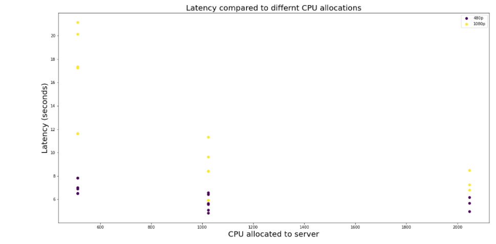
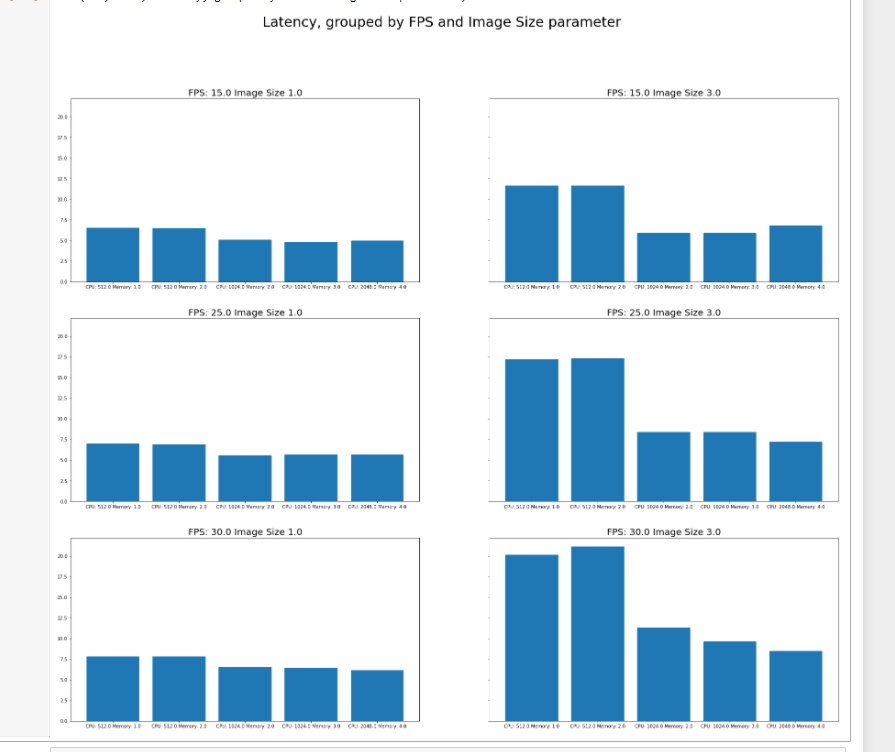
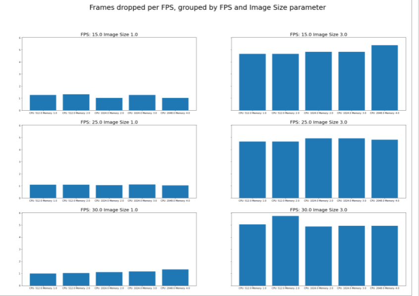
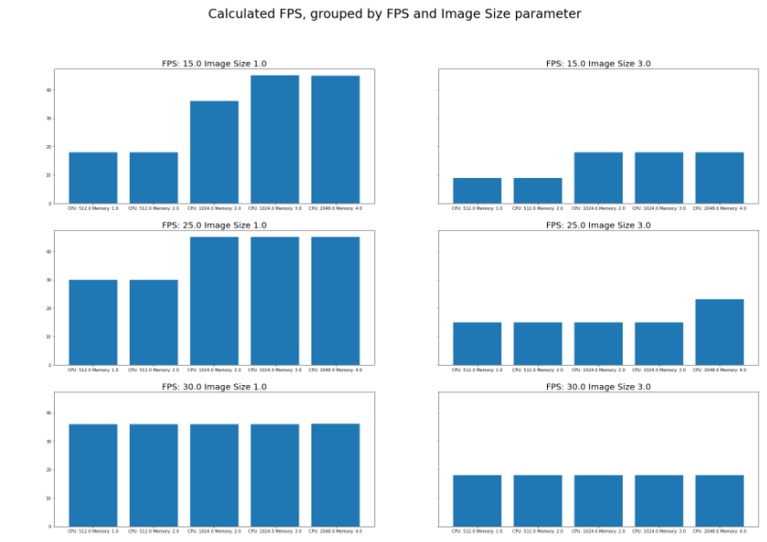
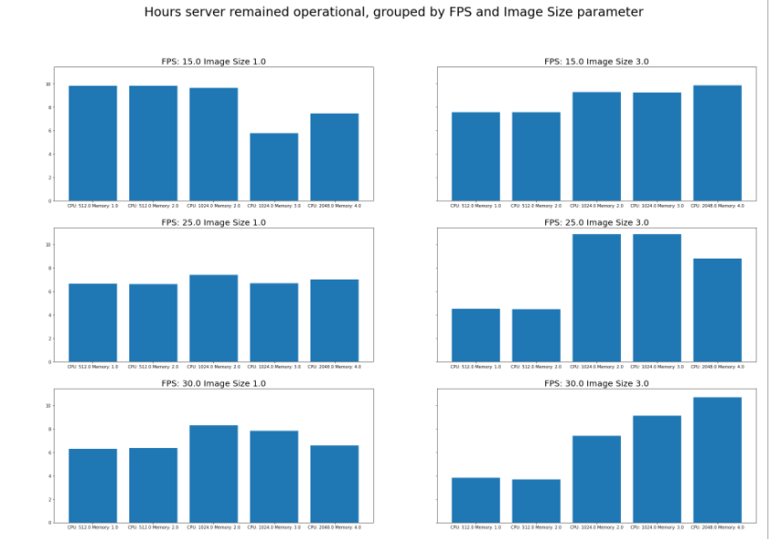

# Report on video stream analysis project

## Goal of the project
We wanted to first find a feasible way to deploy a video streaming server on a docker-as-a-service platform and then analyze 
different configuration options and see how they affect video quality, stability, fps, etc. We were interested in testing 
how the hardware specifications affected performance, mainly the CPU and memory allocations for the video server, as well as 
the video parameters such as image size and FPS of the server. 

## Video server and client development
To fulfill this we needed both a video server and a video client to receive the video and analyze the video. I developed 
a video server that uses [StreamGear](https://abhitronix.github.io/vidgear/latest/gears/streamgear/introduction/), [qrcode](https://pypi.org/project/qrcode/),
and [opencv-python](https://pypi.org/project/opencv-python/) to live generate a QR code video that encodes information
about when it was generated so that it can be scanned and analyzed to deteremin server latency. We utilized a barebones 
[flask](https://flask.palletsprojects.com/en/2.0.x/) server to distribute the video from the server. The server was 
dockerized and put into [Elastic Container Registry](https://aws.amazon.com/ecr/) for ease of deployment to [AWS Fargate](https://aws.amazon.com/fargate/),
which is a pay-as-you-go docker as a service provider. It was an ideal candidate because we could run 1 container at a time
at almost no cost while actively developing, and then easily scale it up to ~60 containers for a longer period of time 
when we wanted to run the larger experiments. The code for this as well as the AWS Cloudformation template to deploy in 
[src](src).    \\

The video client we developed utilizes opencv-python to capture the individual frames, decodes the information in the QRCodes,
and records that information in a SQLite table. When developing we were storing each individual frame, but as we moved to larger 
time horizons this was unfeasible and we kept summary statistics over 10 second intervals. An interesting topic we needed to 
dive into was multithreading in Python, because decoding each frame in real time in a single threaded application slowed 
down the client too much. To do this we utilized [ThreadPoolExecutor](https://docs.python.org/3/library/concurrent.futures.html).

## Experiment
After developing the video client and server we ended up deciding on testing permutations of three FPS options (from the server) - 15, 25, 30 -,
four images sizes - 240p, 480, 720p, and 1080p - and a range of CPU/ Memory configurations for the server ranging from 
512mb CPU - 2048, and 1GB - 4GB of memory. Our options for hardware configuration were limited by the offerings for the 
AWS Fargate service [detailed here](https://docs.aws.amazon.com/AmazonECS/latest/developerguide/AWS_Fargate.html). This came out to 
60 different configurations total, each of which we ran with a dedicated client writing to their own Sqlite database. We aimed to run
each configuration for 12 hours each to compare the data after. The list of configurations can be seen below: 

```	
task_id fps	cpu	memory	image_size				
task_0	15.0	512.0	1.0	0.0
task_1	15.0	512.0	2.0	0.0
task_10	30.0	512.0	1.0	0.0
task_11	30.0	512.0	2.0	0.0
task_12	30.0	1024.0	2.0	0.0
task_13	30.0	1024.0	3.0	0.0
task_14	30.0	2048.0	4.0	0.0
task_15	15.0	512.0	1.0	1.0
task_16	15.0	512.0	2.0	1.0
task_17	15.0	1024.0	2.0	1.0
task_18	15.0	1024.0	3.0	1.0
task_19	15.0	2048.0	4.0	1.0
task_2	15.0	1024.0	2.0	0.0
task_20	25.0	512.0	1.0	1.0
task_21	25.0	512.0	2.0	1.0
task_22	25.0	1024.0	2.0	1.0
task_23	25.0	1024.0	3.0	1.0
task_24	25.0	2048.0	4.0	1.0
task_25	30.0	512.0	1.0	1.0
task_26	30.0	512.0	2.0	1.0
task_27	30.0	1024.0	2.0	1.0
task_28	30.0	1024.0	3.0	1.0
task_29	30.0	2048.0	4.0	1.0
task_3	15.0	1024.0	3.0	0.0
task_30	15.0	512.0	1.0	2.0
task_31	15.0	512.0	2.0	2.0
task_32	15.0	1024.0	2.0	2.0
task_33	15.0	1024.0	3.0	2.0
task_34	15.0	2048.0	4.0	2.0
task_35	25.0	512.0	1.0	2.0
task_36	25.0	512.0	2.0	2.0
task_37	25.0	1024.0	2.0	2.0
task_38	25.0	1024.0	3.0	2.0
task_39	25.0	2048.0	4.0	2.0
task_4	15.0	2048.0	4.0	0.0
task_40	30.0	512.0	1.0	2.0
task_41	30.0	512.0	2.0	2.0
task_42	30.0	1024.0	2.0	2.0
task_43	30.0	1024.0	3.0	2.0
task_44	30.0	2048.0	4.0	2.0
task_45	15.0	512.0	1.0	3.0
task_46	15.0	512.0	2.0	3.0
task_47	15.0	1024.0	2.0	3.0
task_48	15.0	1024.0	3.0	3.0
task_49	15.0	2048.0	4.0	3.0
task_5	25.0	512.0	1.0	0.0
task_50	25.0	512.0	1.0	3.0
task_51	25.0	512.0	2.0	3.0
task_52	25.0	1024.0	2.0	3.0
task_53	25.0	1024.0	3.0	3.0
task_54	25.0	2048.0	4.0	3.0
task_55	30.0	512.0	1.0	3.0
task_56	30.0	512.0	2.0	3.0
task_57	30.0	1024.0	2.0	3.0
task_58	30.0	1024.0	3.0	3.0
task_59	30.0	2048.0	4.0	3.0
task_6	25.0	512.0	2.0	0.0
task_7	25.0	1024.0	2.0	0.0
task_8	25.0	1024.0	3.0	0.0
task_9	25.0	2048.0	4.0	0.0
```

Unfortunately, in practice only half of these configurations ended up proving useful, as for reasons that are not clear 
only the image sizes 480p and 1080p (size 1 and 3 respectively), were able to be decoded without issue, and we ran into 
time constraints. Still, having one smaller size and one significantly larger sized images seems to give us the data we need
and likely serve as a proxy for what data from all 4 would look like. 

## Examining results 
The data from all the experiments was combined with a script in [combine_sqlite.py](scripts/combine_sqlite.py) and explored in
[data_analysis.ipynb](scripts/data_analysis.ipynb). 

### Latency 
Method - to calculate latency I compared the time the QR code was generated from the server and the time the frame was received at,
I averaged that over the recording period (10 seconds) to get an average latency per 10 seconds recording. I first looked at 
the relationship between latency and memory allocation. The chart below shows there appears to be a clear trend latency is significantly higher
between 480p and 1080p, and also that latency tends to go down as more memory is allocated, although there is some diminishing returns,
especially at 480p:


I looked at latency again, but comparing the different CPU configurations and found similar results. Although in this case 
there appeared to be minimal difference for 480p, but for streaming 1080p, 512mb wasn't a good option for live streaming:  


This gives a good overview but what we'd like to know more specifically about latency is how does it change within FPS classes?
This is important because a 15 fps live stream is far less taxing on a server than a 30 fps live stream for example, so just looking at
those scatter plots that nuance is lost. For that reason, I separated it into groups based on the hardware configurations
and made a latency bargraph for each iamge size and each FPS parameter. In the below charts the y axis shows the latency in
seconds and the CPU-Memory configuration. Those are a bit hard to read, so to be clear it says (from left to right):
* CPU: 512.0 Memory: 1.0
* CPU: 512.0 Memory: 2.0
* CPU: 1024.0 Memory: 2.0
* CPU: 1024.0 Memory: 3.0
* CPU: 2048.0 Memory: 4.0  
To me, this chart shows that as you beef up the hardware there is returns to better hardware, however from a bang-for-your-buck
standpoint, the best option is probably the middle option, `CPU: 1024.0 Memory: 2.0` since the performance gains after that are
pretty marginal. 



### Frame dropping
Another area of interest was how many frames we'd be dropping. Some level of frame dropping seems inevitable when live streaming. 
The metric I was interested in for this was frames dropped per FPS, because I knew it was likely FPS would correlate with better hardware, so just looking at raw frames dropped was not a very useful metric.
I found for this there was no discernable trend, besides that frame drops seemed to happen much more often with the larger image size.
I will get into it next, but I'm worried this may have been influenced by a faulty FPS metric. 



### FPS 
Method - I measured FPS by counting the frames per recording period and dividing the # of frames received by the client by 
the time passed since the last recording period. I worry that this wasn't calculated correctly, due to a bug in the code or an error in the methodology
because the FPS does not really match our expecations. It's also possible that there was an error on the server side coding 
that led to the FPS being sent from the server not matching our expectation. However, even if the FPS may not be fully accurate
to the number, we can discern some things from the trend. There seemed to be a light trend in stronger hardware configurations
having stronger FPS performance. THis was very apparent in the 480p group and less so in the 1080p group:



### Looking at failing video servers
An issue we ran into as we got closer to experiment was that after a certain period of time the servers we were running on
Fargate would eventually stop producing new chunks of video and essentially fail. They would remain running, but not in any useful state.
This exposed a weakness in AWS Fargate for a video streaming service like this, because it is difficult or impossible to 
actually SSH into the host machine, making it hard to debug the root cause of the failings. A potential way around this 
would be to depoy the containers on a normal ECS cluster without using Fargate, SSH into that, and debug from there. That was 
outside the scope of this project, but an interesting metric to look at was seeing how far the different configurations made it 
before reaching a failed state. I determined the amount of hours a server lasted before failing by looking at how many
recording periods had valid data (i.e. latency != 0.0), multiplying that count * 10 (10 seconds per recording period), then dividing by 60, and 60 again
to get the amount of hours the servers lasted out of the desired 12. 

The results for this seemed to be overall noisy, but to me the most interesting was the most resource demaning group, 30 fps and 1080p image size,
had a very clear trend of lasting much longer as the hardware improves. Unfortunately, none of the servers made it the full
12 hours we had hoped, but many of them made it 8-10, providing plenty data. I was hoping it would give more indication the nature of the 
server failing, but it really doesn't, besides suggesting that CPU 512 might not be feasible for higher performance workloads:



## Conclusion
The clearest takeaway from the experiment was that we can improve livestreaming latency by upping the hardware, with some
level of diminishing returns depending on your requirements. Additionally, we were able to validate the idea of one-click deploy 
style video servers on a service like AWS Fargate. There was obviously some issues with our actual server, they seem surmountable 
and could be due to a memory leak or some other kind of issue we were not able to debug. We also gained some pragmatic insights
on live video decoding, Python multithreading, AWS cost minimization, working with AWS API's, and container networking that will be useful in other 
projects. Finally, we were able to make an experiment that is both complex and highly reproducible which seems to always be a
problem even in technical research. Developing on my personal account AWS account and local environment and getting it 
deployed on Professor Bell's account with just a short README, some wrapper scripts, and some minor headaches,
serves as a testament to this

## What I would do to improve this experiment 
This experiment was mainly an academic exercise, but if I was ever going to move forward more rigorously with it I would change a few things.
* First I would dig into the FPS calculation issue and see where the discrepancy is, because it would be nice to have better insights on FPS,
as that is a pretty important metric to video consumers. 
* I would also like to include some video quality metrics, like 
[VMAF](https://en.wikipedia.org/wiki/Video_Multimethod_Assessment_Fusion) as that would make this a more robust tool.
* Another  thing we wanted to implement, but were unable to given time constraints was comparing live generated videos vs. pre-canned videos, 
that way we could see to what extent if any the live video generation drags on server performance. It could also help eliminate
the hypothesis that opencv-python use on the server is what's causing them to fail over time

## Other ideas
Looking at this tool/ project as is there's not too much sense in developing it further, beyond improving this isolated experiment,
because it is pretty tightly coupled to the experiment itself. However, we did tackle some problems that are probably
more generalizable. One of those was one click docker deploys and teardowns on Fargate. This was pretty neat because it didn't
require keeping a host machine running like K8's or ECS, but did allow for easy flexibility. However, many people who would
use this to run similar academic experiments or otherwise, very likely do not have the prerequisite knowledge or time to build 
and maintaining it. [start_stop_streaming.py](video_client/start_stop_streaming.py) is a good example of the complexity most people 
would prefer to avoid. Maybe there's room to build a utility that allows anyone who already knows how to build docker containers 
to deploy/ teardown them with a click, without worrying about much else?  

Another one was making a more general video frame analyzer package. Our frame analyzer covers a very narrow use case in 
decoding QRCodes, but people have a lot of use cases for decoding live video streams. For example, if I wanted to build an application to 
scrape sports scores from live games, a place I might start by pointing Streamgear (rather than Streamgear) at a live sports event,
like an NBA game, and instead of QR Decoder, use something like [python-tesseract](https://nanonets.com/blog/ocr-with-tesseract/) to 
figure out what teams are playing and what's the score, and serve that information from an API or something. 